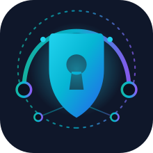
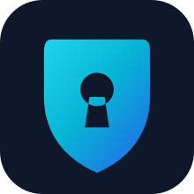

<p align="center">
  
</p>

<h2 align="center">The brain behind your secrets.</h2>

<p align="center">
  Unified secrets control plane for cloud-native teams.<br/>
  Approvals · RBAC · audit · least-privilege agent execution<br/>
  across <b>HashiCorp Vault</b>, <b>AWS Secrets Manager</b>, <b>Azure Key Vault</b>, <b>GCP Secret Manager</b>, and <b>Kubernetes / GitOps</b>.
</p>

<p align="center">
  <a href="https://secrets-bridge.io">secrets-bridge.io</a>
</p>

---

## The model

```text
Control Plane (the brain)  =  decisions, workflow, metadata, audit, RBAC, jobs, status
Agent                       =  least-privilege execution inside the target account / cluster
Providers                   =  the actual secret values (source of truth)
```

The Control Plane **never holds your secret values** or broad provider access. A lightweight, **outbound-only agent** runs inside each target boundary and executes approved jobs locally with scoped credentials.

## Why

Developers need a safe way to request and update secrets without broad provider access. Security teams need approvals, separation of duties, and an audit trail. Platform teams need cross‑provider sync with drift and conflict visibility.

**One brain, every provider.** Secrets Bridge brings governance and synchronization together in one platform — without replacing the tools your teams already use.

## Repositories

| Repo | What it is |
|------|-----------|
| [**core**](https://github.com/secrets-bridge/core) | Shared Go module — provider connectors, sync engine, shared types |
| [**api**](https://github.com/secrets-bridge/api) | Control Plane API (Go + Fiber) |
| [**worker**](https://github.com/secrets-bridge/worker) | Background workers (Go) |
| [**agent**](https://github.com/secrets-bridge/agent) | Outbound-only, least-privilege execution agent (Go) |
| [**controller**](https://github.com/secrets-bridge/controller) | Kubernetes operator + CRDs for SecretsSync (GitOps) |
| [**ui**](https://github.com/secrets-bridge/ui) | Dashboard SPA (React + TypeScript + Vite) |
| [**charts**](https://github.com/secrets-bridge/charts) | Helm charts / deploy manifests |
| [**docs**](https://github.com/secrets-bridge/docs) | Documentation site → [secrets-bridge.io](https://secrets-bridge.io) |

## Security principles

- **No central store of secret values** — compromising the control plane exposes nothing.
- Agents are **outbound-only** and least-privilege, with no database or cache dependency.
- Every privileged action is **audited** with a correlation ID.
- Provider access is **scoped** by account, project, environment, path, tag, or policy.

## Brand

<p align="center">
  
  &nbsp;&nbsp;&nbsp;
  
  &nbsp;&nbsp;&nbsp;
  
</p>

<p align="center"><sub>Wordmark · icon set · favicon · <b>Bridgey</b> the mascot — all in <a href="./"><code>profile/</code></a>. Canonical design source: the Figma file <b>Secrets Bridge — Brand</b>.</sub></p>

---

🚧 **Status:** actively refactoring from a Kubernetes sync controller (v0.1.0) into the full control plane platform.
